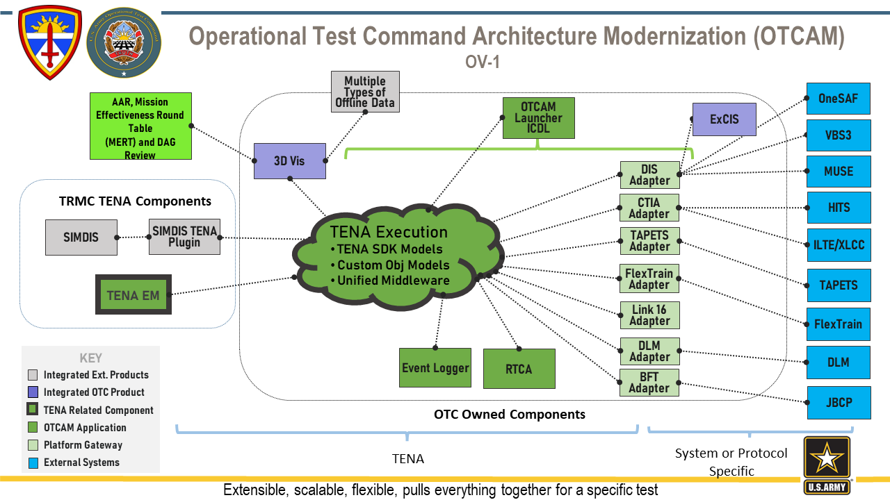

# Introduction 
OTCAM is a blanket program that currently contains two applications:  ICDL and 3DVis.  OTCAM is owned, developed and maintained by OTC contractors.  It is constantly being modified to meet different test requirements.   

ICDL is an application that provides a way for different LVC systems to interoperate via a common TENA interface.  It can provide an interface between Live RTCA systems like HITS, XLCC and Flextrain and simulation systems like OneSAF, ExCIS and MUSE.  It allows simulated fire missions to have effects on real players and allows real players' locations and health to be seen by simulations.  It has built-in data collection abilities that can be utilized in post-event analysis in 3DVis.

3DVis is an application that provides data visualization on a 3D map, both live and post-event.  Live, it interfaces with ICDL and provides the current Common Operating Picture (COP) while allowing the user to back up in time and replay past events.  It can offer some interactive control over the RTCA status of live players.  Post-event, it provides the same 3D map while replaying and time-synchronizing the events from multiple data sources including LVC data from the OTCAM database, video captures, JBCP messaging, and manual data including TIRs and surveys.  Custom displays can be developed per test.  These have included LIDAR scans and results, system alerts, CSV locations, UAS metadata, and data logs.           



# Getting Started
This section describes how to install required tools, authenticate Git, clone the OTCAM Lite repository, build the software, and run 3DVis.

## AVD Software Install
From the GPU AVD Software Center:
1. Install **OpenJDK 21**
2. Install **Git**
3. Install **VSCode**

## Create Azure Repo PAT
1. Login to Azure DevOps: https://devops.cloud.army.mil/ATEC%20Data%20Mesh/OTC  
2. Click your **User Icon** in the top right  
3. Select **Security**  
4. Select **New Token**  
5. Create a token (use *Full Access* for now)  
6. Save the PAT (Personal Access Token) to a local .txt file  

## Add PAT Credentials to Git
Open PowerShell on the GPU AVD and run the following (replace `yourPAT` with the PAT from the previous step):

```powershell
$MyPat = "yourPAT"
$B64Pat = [Convert]::ToBase64String([System.Text.Encoding]::UTF8.GetBytes(":$MyPat"))
git config --global --remove http.https://devops.cloud.army.mil
git config --global --add http.https://devops.cloud.army.mil.extraHeader "Authorization: Basic $B64Pat"
Clone Code Repo
Open VSCode

Select Clone Git Repository

Paste the repository URL:

perl
Copy code
https://devops.cloud.army.mil/ATEC%20Data%20Mesh/OTC/_git/OTCAM%20Lite
Open the cloned folder in VSCode

Build OTCAM
In the VSCode terminal, run:

powershell
Copy code
.\gradlew clean deployAll
This produces the full application distribution in build\dist\.

Run OTCAM
Run 3DVis from the distribution folder:

powershell
Copy code
cd build\dist
.\jre\bin\java.exe -DTENA_PLATFORM="w10-vs2019-64" -DTENA_VERSION="6.0.8" -jar ".\3DVis-2.0.2.20.jar"
Build and Test
OTCAM Lite is built using Gradle. The deployAll task packages the JRE, libraries, DLLs, external resources, and the application JAR into a runnable distribution.

Unit tests (if implemented in the future) can be executed using:

powershell
Copy code
.\gradlew test
Contribute
Please coordinate contributions with the OTC development team. Development practices follow standard Azure DevOps workflows including:

Branching

Pull Requests

Code Review

Versioned Builds

If you want to learn more about creating good README files then refer to the following guidelines.

You can also seek inspiration from these example README files:

ASP.NET Core

Visual Studio Code

Chakra Core